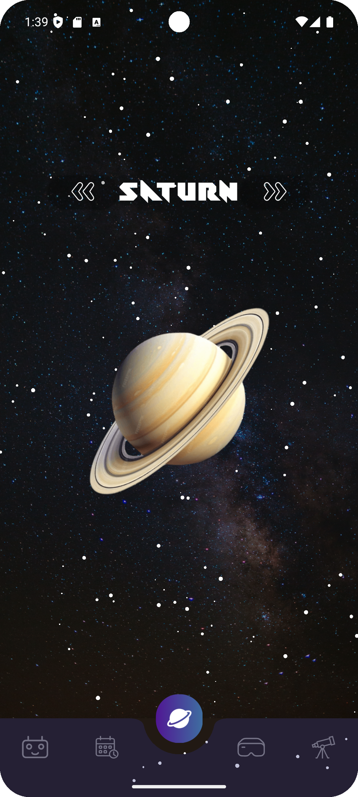
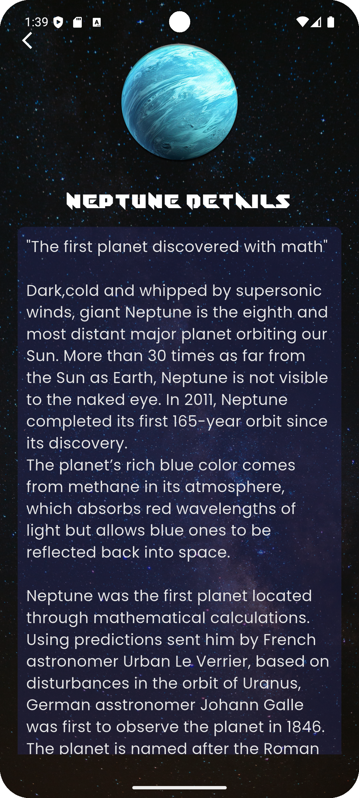
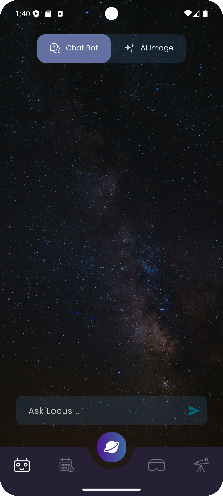
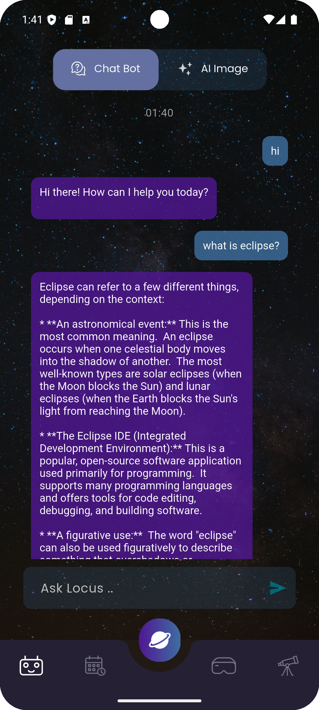
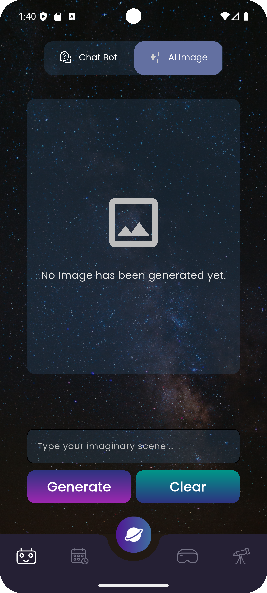
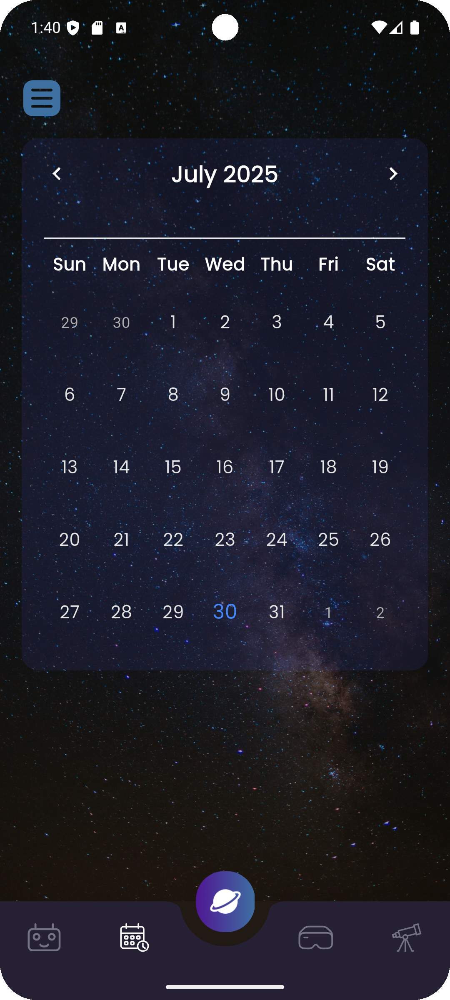
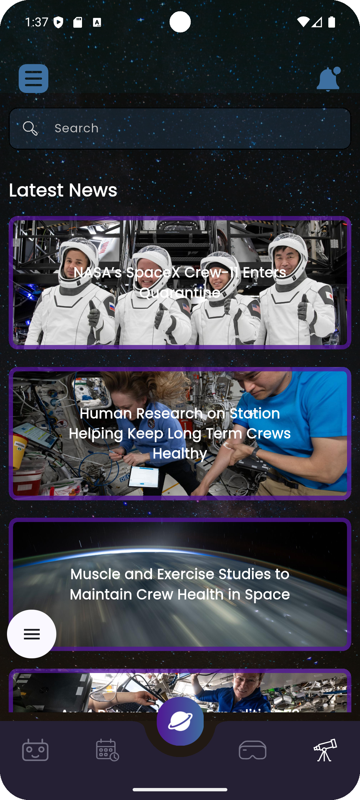
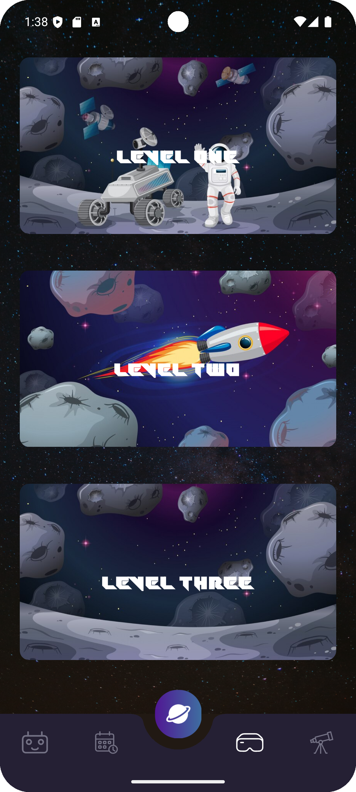
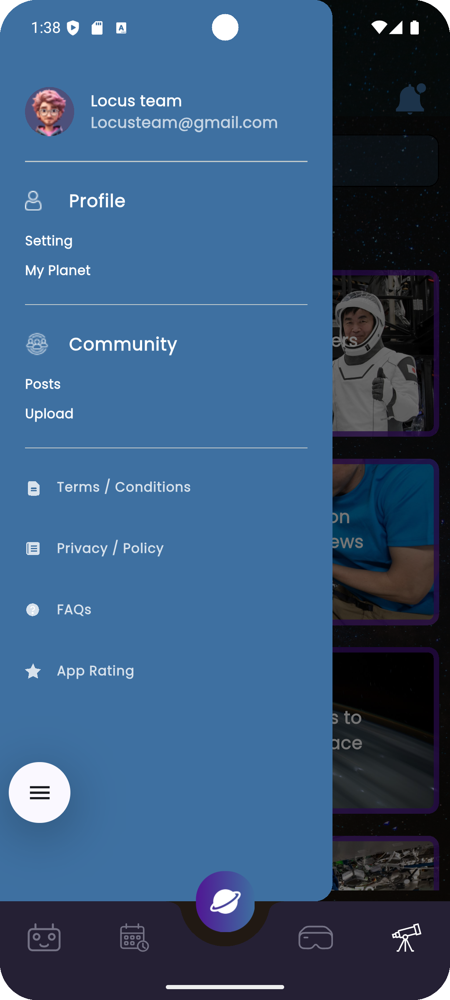

# LOCUS

A space information application that offers users a unique and enriched experience in exploring and learning about space. 
The application targets two user groups:

- Students in the fields of aerospace sciences and space technology.
- Space enthusiasts and hobbyists interested in space exploration and events.

## Appendix

This app has 5 main features including the possibility to link VR simulation ingine section for educational Satellites control and space navigation. 
The app has an old version with some defacts but this repository is the updated one.

## Demo

Old demo (A video shows functionality in details): https://drive.google.com/drive/folders/1M3NVlJaUedriFVrMUVhgOyWwoUKSfs9p?usp=sharing

New demo (A screenshots shows only updated sections, you can run the code for full vision):
<h3>📱 App Screenshots</h3>

  
  
  

  
  
  
  

  
  
  

## Features

- Calendar: Provides dates of space events along with detailed information, including images and descriptions. The calendar covers past and upcoming events.
- AI Chatbot: An intelligent assistant that answers any space-related questions.
- AI Image Generator: Offers customized space images based on user requests and specified details.
- Up-to-date space news, explore and know each and every discovery happened in the outer space.
- Solar System Knowledge Base, shows each planet in the solar system in an animated way (Planet move around itself and stars floats behind it in a slow random directions), you can choose any planet and it will shows a lot of information about it.
- VR (Virtual Reality game): divided into 3 stages:
  ### WILL BE LINKED AFTER UNITY DEVELOPERS FINISH IT
        Stage 1: Building a CubeSat satellite in a lab that provides all the necessary tools and instructions through virtual reality.
        Stage 2: After completing the satellite's construction, users enter a room filled with screens that control the launch of a rocket carrying the satellite. Users can activate the rocket launch mode and witness its takeoff.
        Stage 3: Still in process.
- A platform for space enthusiasts to gather and share their interests through a social media page for posting and interacting with others.
- User profile page.
